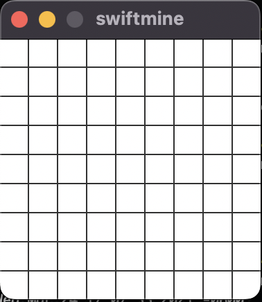

# Minesweeper
Cross platform Minesweeper with Swift 5 and QT.

## Swift

- [x] Windows
- [x] Mac OSX
- [x] Linux

## Qt

- [x] Windows
- [x] Mac OSX
- [x] Linux

## Building

Qt must be installed.  On MacOS with brew `brew install qt@5`.  For simplicity, I tend to work out of legacy global directories, so copy `/opt/homebrew/opt/qt@5` to `/usr/local/opt/qt/`.

`swift build`

## Screenshot

